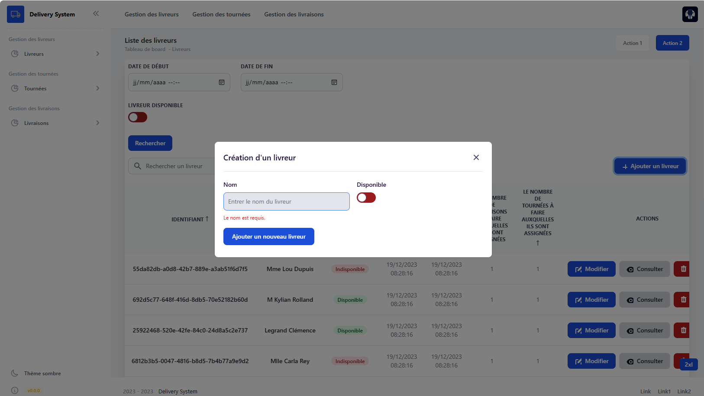

# Deliverysystem

# Présentation

Le système doit permettre la gestion de livreurs, de tournées et de livraisons.

**Delivery System (Front-end)** est [Application Web Monopage](https://fr.wikipedia.org/wiki/Application_web_monopage) (SPA = Single Page Application) qui permet la gestion de livreurs, de tournées et de livraisons.

## Prévisualisation

### Thème


### Livreur



### Tournée


### Livraison


Ce projet est une implémentation d'un gestion de livraisons pour le module Full-Stack.
Ce dépôt (repository) concerne la partie front-end de ce projet.

# Informations

Afin de consulter les informations du projet, vous trouverez ces informations dans le fichier ```package.json``` et ```angular.json```.
Docker on a utilisé le nginx.conf : Le listen 4200; doit avoir le même port que celui de docker

```
docker compose --build up
```

## Fonctionnalités principales

### Configuration requise

## Installation

1. Clonez ce référentiel sur votre machine locale.
2. Ouvrez un terminal et naviguez vers le répertoire du projet.
3. Pour le back-end :
   - Assurez-vous d'avoir Docker installé.
   - Exécutez la commande `docker-compose up --build` pour lancer l'application back-end en utilisant Docker.
4. Pour le front-end :
   - Docker :
      - `docker-compose up --build`
   - En local : 
      - Accédez au répertoire `frontend` avec `cd frontend`.
      - Exécutez la commande `npm install` pour installer les dépendances.
      - Exécutez la commande `ng serve` pour démarrer l'application front-end en mode de développement.

## Utilisation

1. Ouvrez l'application front-end en accédant à l'URL (`http://127.0.0.1:4200/`) fournie par la commande `ng serve`.
2. Sur la page principale, vous pouvez voir la liste de toutes vos notes existantes.
3. Cliquez sur le bouton "Ajouter une Note" pour créer une nouvelle note.
4. Remplissez le titre, le contenu et la date de la note.
5. Cliquez sur le bouton "Enregistrer" pour ajouter la note.
6. Vous pouvez également cliquer sur le bouton "J'aime" pour montrer que vous aimez une note.

## Technologies Utilisées

- [Angular](https://angular.io/): Angular est un framework JavaScript open-source développé par Google pour la création d'applications web dynamiques.
- [Docker](https://www.docker.com/): Docker est une plateforme de conteneurisation qui facilite le déploiement d'applications dans des conteneurs logiciels.

## Commandes courantes de Docker Compose

1. **Démarrer les conteneurs en arrière-plan :**
   ```
   docker-compose up -d
   ```
   Cette commande démarre tous les conteneurs définis dans le fichier `docker-compose.yml` en arrière-plan.

2. **Voir le statut de la stack :**
   ```
   docker-compose ps
   ```
   Utilisez cette commande pour afficher le statut de tous les services de votre stack.

3. **Afficher les logs de la stack (5 dernières lignes) :**
   ```
   docker-compose logs -f --tail 5
   ```
   Cette commande affiche en continu les cinq dernières lignes des logs de votre stack.

4. **Arrêter les services de la stack :**
   ```
   docker-compose stop
   ```
   Utilisez cette commande pour arrêter tous les services de votre stack sans détruire les ressources.
5. **Détruire les ressources de la stack :**
   ```
   docker-compose down
   ```
   Cette commande arrête et supprime l'ensemble des ressources de votre stack, y compris les conteneurs, les réseaux et les volumes.
6. **Valider la syntaxe du fichier `docker-compose.yml` :**
   ```
   docker-compose config
   ```
   Cette commande permet de vérifier la validité de la syntaxe de votre fichier `docker-compose.yml`.

## Licence
Ce projet est publié sous la licence MIT. Pour plus d'informations, consultez le fichier LICENSE.

[](https://choosealicense.com/licenses/mit/)

# Crédits

- Toast notifications : https://github.com/8Tesla8/angular-custom-toast-notification
- Les injections de dépendances : https://angular.io/guide/dependency-injection
- Sanitize : https://stackoverflow.com/questions/54087739/angular-7-prevent-escaping-of-html-tags-inside-a-string-variable-passed-to-chil
- Tutoriel pour déployer : https://www.arunyadav.in/codehacks/blogs/post/19/create-an-angular-app-and-deploy-using-in-nginx-and-docker
- Keycloak : https://github.com/mauriciovigolo/keycloak-angular

# Informations complémentaires

- Injections :
```
@Injectable({
  providedIn: 'root',
})
Pas d'injection dans le root level, l'injection se fait dans le providers afin 
de mieux comprendre les injections,
car si elles sont fait depuis le root level, elles sont alors disponible dans toutes
l'application et donc c'est pas très utile dans certains cas.
```
Dans ce projet, chaque composant est standalone afin qu'ils soit indépendant et donc n'importe et n'exporte pas les composants
dans les modules.

- docker compose up --build : Si vous utilisez build: . dans votre fichier Docker Compose pour définir un service, cela signifie que vous souhaitez construire une image Docker en utilisant le Dockerfile situé dans le répertoire actuel (.). Cette image construite sera utilisée pour exécuter le service spécifié dans votre fichier Docker Compose.

Nettoyer des entrées utiliteurs :
Utiliser ça pour les données envoyer dans le formulaire pour sanitaze : 
https://angular.io/guide/security
https://snyk.io/fr/blog/angular-security-best-practices/

Durant la phase de développment, on utilise la compilation Jit (Just in Time) mais sinon dans la phase de production c'est 
AOT (Ahead-of-time) (https://angular.io/guide/aot-compiler) (avec l'option --aot)

# Rapport

## Front-end

### Architecture

#### Composants réutilisables (standalone)
Pour le front-end, j'ai choisit de ne pas utiliser les NgModules.
J'ai choisit de me baser que sur des composants standalone qui sont réutilisables.
Plutôt que d'importer un module entier avec potentiellement des composants et services inutilisés, les composants autonomes te permettent de créer des composants individuels qui encapsulent leur propre fonctionnalité et leurs dépendances.Pour en savoir plus à ce sujet : https://blogs.halodoc.io/angular-standalone-components-unleashed-exploring-the-magic-of-a-world-without-ngmodule/

- https://blogs.halodoc.io/angular-standalone-components-unleashed-exploring-the-magic-of-a-world-without-ngmodule/

This project was generated with [Angular CLI](https://github.com/angular/angular-cli) version 16.2.3.

# Améliorations

## Session Management

## Session Management côté client
```
Le cas le plus complexe est celui où le client est un browser.
Si vous souhaitez persister des données dans le browser afin que l’utilisateur puisse retrouver le même contexte en changeant de fenêtre ou après un refresh :
Evitez absolument l’utilisation des cookies ne serait-ce que pour les raisons suivantes :
Ce n’est pas leur rôle.
Vous ne voulez pas envoyer toutes ces données au backend à chaque requête.
Cookies are EVIL !

IndexedDB et localStorage sont là pour ça.

Problème :
L'IndexedDB et le localStorage n’ont pas de notion d’expiration sauf sur Firefox :  https://developer.mozilla.org/en-US/docs/Web/API/IDBFactory/open.
Jetez un coup d’oeil au contenu de vos storages après logout ou fermeture du browser, vous serez surpris de découvrir ce qu’on y retrouve.

Secure Storage
en attendant une solution in-the-browser, il est recommandé de chiffrer les données stockées localement avec une clé temporaire et unique pour chaque client transmise par l’API ReST,
https://github.com/jas-/crypt.io,
ou encore mieux, en stockant la clé via l'API browser webauthn quand celle-ci sera globalement disponible. https://developers.google.com/web/updates/2018/05/webauthn
```
Source : https://guide-api-rest.marmicode.fr/securite-des-apis-rest/authentification-et-session-management

## Development server

Run `ng serve` for a dev server. Navigate to `http://localhost:4200/`. The application will automatically reload if you change any of the source files.

## Code scaffolding

Run `ng generate component component-name` to generate a new component. You can also use `ng generate directive|pipe|service|class|guard|interface|enum|module`.

## Build

Run `ng build` to build the project. The build artifacts will be stored in the `dist/` directory.

## Running unit tests

Run `ng test` to execute the unit tests via [Karma](https://karma-runner.github.io).

## Running end-to-end tests

Run `ng e2e` to execute the end-to-end tests via a platform of your choice. To use this command, you need to first add a package that implements end-to-end testing capabilities.

## Further help

To get more help on the Angular CLI use `ng help` or go check out the [Angular CLI Overview and Command Reference](https://angular.io/cli) page.
